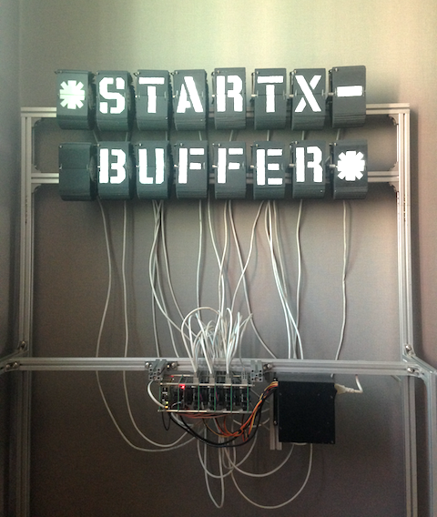

# (+ STARTX EMACS) => \*STARTX-BUFFER\*

<!--  -->

## STARTX IS A MACHINE,
* SPLIT-FLAP DISPLAY MODUL x 16
* RASPBERRY PI, CHIPKIT, IP CAMERA
* PUREDATA, VIA OSC

## STARTX-BUFFER IS A EMACS MINOR MODE,
* A EXPERIMENTAL PHYSIKAL REMOTE BUFFER
* REAL TIME KEYINPUT HIJACKER FROM EMACS TO THE STARTX

### DEPENDANCY
* SLIME <https://github.com/slime/slime>
* MPV <http://mpv.io>

### INSTALLATION
```
(add-to-list 'load-path "path/to/startx-buffer/")
(require 'startx-buffer)
```

## CONNECT TO STARTX-BUFFER
### SSH TUNNELING
``` 
(defun tunnel ()
  (interactive)
  (call-process-shell-command
  "sshpass -p startx ssh -fNL 4004:localhost:4004 startx@mut.dlinkddns.com &"))
```
`M-x tunnel`
  
### IP CAMERA
```
(defun vue ()
  (interactive)
  (call-process-shell-command
  "mpv rtsp://mut.dlinkddns.com:554/ch0_1.h264
  --no-audio --framedrop=vo --osd-align-x=right --osd-align-y=top &"))
``` 
`M-x vue`

### SLIME
`M-x slime-connect (RET) 127.0.0.1 (RET) 4004 (RET)`
### STARTX
```
CL-USER> (startx)
->->->alle null kalibriert, denke ich.
NIL
CL-USER>
```
### STARTX-BUFFER

`M-x startx-buffer`
* FROM NOW YOU CAN USE THE PHYSIKAL BUFFER \*STARTX-BUFFER\*

## COMMAND
```
CL-USER> (startx)      ; start the machine startx
CL-USER> (agur)        ; turn off the maschine
```
* `C-a`         ; move-beginning-of-\*startx-buffer\*
* `C-k`         ; kill-rest in \*startx-buffer\*
* `<backspace>` ; backward-delete-char in \*startx-buffer\*
* `(x "foo")`   ; write "foo" to \*startx-buffer\*

<!-- ## STARTX-THEATRE IS A REMOTE LIVE THEATRE ENVIRONMENT, -->
<!--  -->

<!-- * LIVE CODING INSPIRED -->
<!-- * SATELLITE REMOTE PROGRAMMING INSPIRED  -->
<!-- * "THE LIBRARY OF BABEL BY JORGE LUIS BORGES" GELESEN. -->

## SCREENCAST

## TODO
* RES/ SPONTANEOUS SLIME-CONNECT ERFOLGREICH, PERO MAS CHECKEN
* HIDDEN COMMAND ZU DOCUMENTATION
