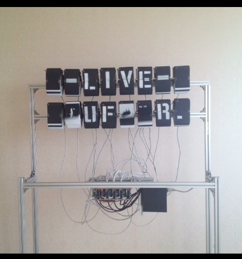
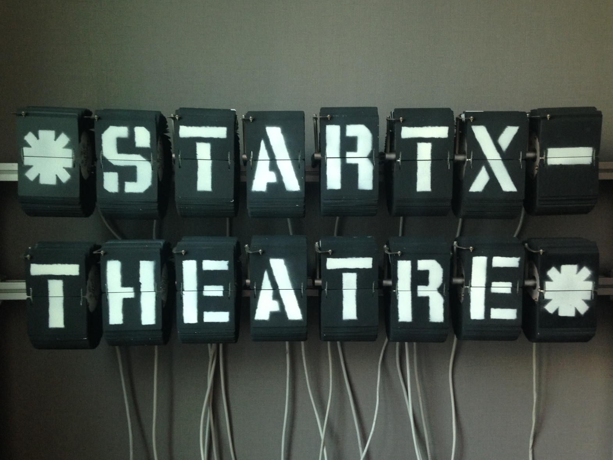

# (+ STARTX LISP) => STARTX-BUFFER

## STARTX is a homebrewed machine,
* split display modul x 16
* raspberry pi, chipkit, ip camera, puredata
* communication via OSC

## STARTX-BUFFER is,

- a experimentalische physikal buffer
- \*scratch\* buffer in emacs inspired.
- startx-buffer-mode.el (ELISP - REAL TIME KEYINPUT HIJACKER TO STARTX IN EMACS)

(add-to-list 'load-path "/Users/dvnmk/Dropbox/STARTX/startx-buffer-buffer/")
(require 'startx-buffer-mode)

## startx-buffer.lisp is,

Syntax
------
`M-x startx-mode
`

`(defun tunnel ()
  (interactive)
  (call-process-shell-command "ssh -fNL 4004:localhost:4004 pi@mut.dlinkddns.com &"))
`
Demo
----

Todo
----

