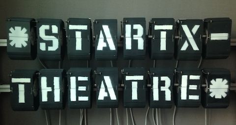

# (ƒ STARTX EMACS) => \*STARTX-BUFFER\*

<!--  -->

## STARTX IS A MACHINE,
* SPLIT-FLAP DISPLAY MODUL x 16
* RASPBERRY PI, CHIPKIT, IP CAMERA
* PUREDATA, VIA OSC

## STARTX-BUFFER IS A EMACS MINOR MODE,
* A EXPERIMENTAL PHYSIKAL REMOTE BUFFER
* REAL TIME KEYINPUT HIJACKER FROM EMACS TO THE STARTX

### DEPENDANCY
* SLIME <https://github.com/slime/slime>
* mpv <https://mpv.io> (or VLC <https://www.videolan.org>)

### INSTALLATION
```
(add-to-list 'load-path "path/to/startx-buffer/")
(require 'startx-buffer-mode)
```

## CONNECT TO STARTX-BUFFER
### SSH TUNNELING
* FOR THE FIRST TIME, FROM SHELL (REGISTERING THE SERVER FINGERPRINT)
``` bash
$ ssh -fNL 4004:localhost:4004 startx@mut.dlinkddns.com
(...blah...blah...blah...)
Are you sure you want to continue connecting (yes/no)? yes
startx@mut.dlinkddns.com's password: startx
``` 

* AFTER THAT,
``` common-lisp
(defun tunnel ()
  (interactive)
  (start-process "tunnel" "tunnel-msg" 
  "sshpass" "-p" "startx" "ssh" "-fNL" "4004:localhost:4004" "startx@mut.dlinkddns.com")
  (switch-to-buffer "tunnel-msg"))
```
`M-x tunnel`
  
### IP CAMERA
* FROM SHELL
``` bash
$ mpv rtsp://mut.dlinkddns.com:554/ch0_1.h264 --no-audio
```
* OR, IN Emacs
``` common-lisp
(defun vue ()
  (interactive)
  (call-process-shell-command
   "open -a mpv --args rtsp://mut.dlinkddns.com:554/ch0_1.h264 --no-audio
   --framedrop=vo"
   nil 0))
``` 
`M-x vue`

### SLIME
`M-x slime-connect (RET) 127.0.0.1 (RET) 4004 (RET)`
### STARTX
```
CL-USER> (startx)
->->->THE MASCHINE STARTX INITIALIZED, VERMUTE ICH.
NIL
CL-USER>
```
### STARTX-BUFFER

`M-x startx-buffer-mode`
* FROM NOW YOU CAN HACK THE PHYSIKAL BUFFER \*STARTX-BUFFER\*

## COMMAND
```
CL-USER> (startx)      ; start the machine startx
```
* `C-a`				; move-beginning-of-\*startx-buffer\*
* `C-k`				; kill-rest in \*startx-buffer\*
* `<backspace>`		; backward-delete-char in \*startx-buffer\*
* `M-x xm` `C-c m`   ; send currnet line or region to \*startx-buffer\*

``` common-lisp
(x "foo")   ; send "foo             " to *startx-buffer*
(a "f")     ; send "ffffffffffffffff" to *startx-buffer*
(kali)      ; calibrate *startx-buffer* again 
(agur)      ; turn off the maschine
```

<!-- ## STARTX-THEATRE IS A REMOTE LIVE THEATRE ENVIRONMENT, -->
<!--  -->

<!-- * LIVE CODING INSPIRED -->
<!-- * SATELLITE REMOTE PROGRAMMING INSPIRED  -->
<!-- * "THE LIBRARY OF BABEL BY JORGE LUIS BORGES" GELESEN. -->

## DEMO

## TODO
* HIDDEN COMMAND ZU DOCUMENTATION
  * \*STATUS\*
* (sag) ZU KORIGIEREN
* (x+ ∂) Y (x- ∂) /M LANGE VERSION
* (startx) IMMER WARTEN OD. ZU THREAD
* UNICODE EXCEPTION
** ASCIIFY?
* (kali) WARTE LOCK ; (kali-warte) 
* STALL RESET λ
* FEEDBACK y (mach-socket) DEBUG, CCL VS VNC 
* ESCAPE \ KORIGIEREN
* (kali) (startx) SOLCHE INTERACTIVE VER. FUNCTION ALS THREAD OD. N?
* ALLE BEENDET-P
* SHORT-STORY
* ESCAPE-CHARACTER \

* LOAD SYNOPSYS
* REMOTE ANIMOTE POETERY M
* REMOTE GEHIRN ZEI
* BABELFISH
* BEWEG SICH
* SAG
* XM DANACH, WO KONTROL
* LIVECODING THE CODE INSELF
* QUIT DEFUN
* MPV SD
* LINUX CMD
* MOV TLE
* OMX
* STARTXBUFFER INFO
* BIND OTHER NAME
* X ETWAS DEMO
* SLIME SERUP IN EL
