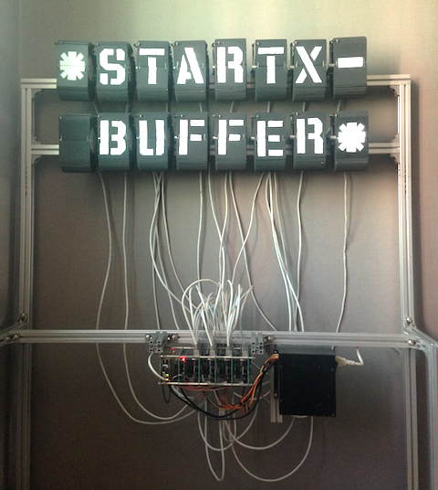

# (ƒ STARTX EMACS) => \*STARTX-BUFFER\*

<!--  -->

## STARTX IS A MACHINE,
* SPLIT-FLAP DISPLAY MODUL x 16
* RASPBERRY PI, CHIPKIT, IP CAMERA
* PUREDATA, VIA OSC

## STARTX-BUFFER IS A EMACS MINOR MODE,
* A EXPERIMENTAL PHYSIKAL REMOTE BUFFER
* REAL TIME KEYINPUT HIJACKER FROM EMACS TO THE STARTX

### DEPENDANCY
* SLIME <https://github.com/slime/slime>
* MPV <http://mpv.io> or VLC <http://www.videolan.org>

### INSTALLATION
```
(add-to-list 'load-path "path/to/startx-buffer/")
(require 'startx-buffer)
```

## CONNECT TO STARTX-BUFFER
### SSH TUNNELING
* FOR THE FIRST TIME, FROM SHELL (REGISTERING THE SERVER FINGERPRINT)
``` bash
$ ssh startx@mut.dlinkddns.com
(...blah...blah...blah...)
Are you sure you want to continue connecting (yes/no)? yes
startx@mut.dlinkddns.com's password: startx
``` 

* AFTER THAT,
``` common-lisp
(defun tunnel ()
  (interactive)
  (call-process-shell-command
  "sshpass -p startx ssh -fNL 4004:localhost:4004 startx@mut.dlinkddns.com &"))
```
`M-x tunnel`
  
### IP CAMERA
``` common-lisp
(defun vue ()
  (interactive)
  (call-process-shell-command
  "mpv rtsp://mut.dlinkddns.com:554/ch0_1.h264
  --no-audio --framedrop=vo --osd-align-x=right --osd-align-y=top &"))
``` 
`M-x vue`

### SLIME
`M-x slime-connect (RET) 127.0.0.1 (RET) 4004 (RET)`
### STARTX
```
CL-USER> (startx)
->->->the maschine startx initialized, vermute ich.
NIL
CL-USER>
```
### STARTX-BUFFER

`M-x startx-buffer`
* FROM NOW YOU CAN HACK THE PHYSIKAL BUFFER \*STARTX-BUFFER\*

## COMMAND
```
CL-USER> (startx)      ; start the machine startx
```
* `C-a`         ; move-beginning-of-\*startx-buffer\*
* `C-k`         ; kill-rest in \*startx-buffer\*
* `<backspace>` ; backward-delete-char in \*startx-buffer\*
* `M-x x-current-line-or-region`   ; send currnet line or region to \*startx-buffer\*

``` common-lisp
(x "foo")   ; send "foo             " to *startx-buffer*
(kali)      ; calibrate *startx-buffer* again 
(agur)      ; turn off the maschine
```

<!-- ## STARTX-THEATRE IS A REMOTE LIVE THEATRE ENVIRONMENT, -->
<!--  -->

<!-- * LIVE CODING INSPIRED -->
<!-- * SATELLITE REMOTE PROGRAMMING INSPIRED  -->
<!-- * "THE LIBRARY OF BABEL BY JORGE LUIS BORGES" GELESEN. -->

## SCREENCAST

## TODO
* RES/ SPONTANEOUS SLIME-CONNECT ERFOLGREICH, PERO MAS CHECKEN
* HIDDEN COMMAND ZU DOCUMENTATION
* IN LISP KONTROLL DIE SATZ, DIE MEHR ALS 16 CHAR SIND.
 * ~~FAST OK, AUF-R DIE NAME DER FUNS~~
 * ~~WARTE BIS ALLE GESTOPPT?~~
  * \*STATUS\*
* (sag) ZU KORIGIEREN
* (x+ ∂) Y (x- ∂) /M LANGE VERSION
* ~~(kali 0 1) .el /M &optional~~
* (startx) IMMER WARTEN OD. ZU THREAD
* UNICODE EXCEPTION
* KONTAKT /M TELEGRAM?
* (kali) WARTE LOCK ; (kali-warte) 
* STALL RESET λ
* ~~THREAD IN EMACS WIE?~~
* ~~(IN-PACKAGE #:CL-USER)~~
* ~~ELISP HOTKEY /M DOUBLE QUOTE EXCEPTION~~
* ~~not DOWNCASED-STR ALS arg~~
* (agur) AUCH THREAD?
* (startx) AUCH THREAD?
* FEEDBACK y (mach-socket) DEBUG, CCL VS VNC 
* VLC y MPV : WHICH IST BETTER?
* ESCAPE \ KORIGIEREN
